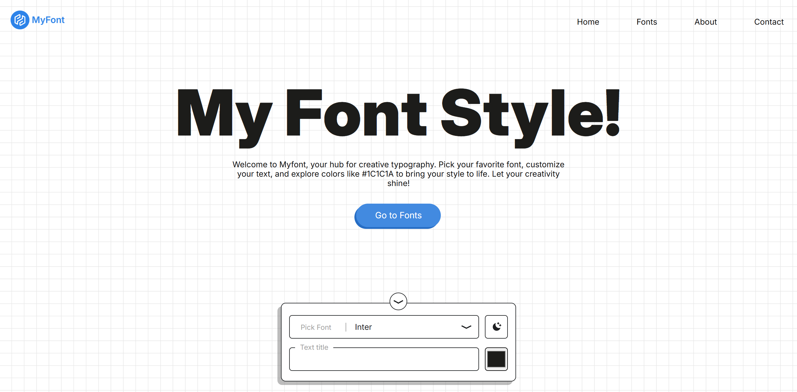

# **MyFont - Your Ultimate Font Customization Tool**  

## 🎨 **Customize, Download, and Enhance Your Fonts!**  
Welcome to **MyFont**, the go platform for font enthusiasts! Whether you're a designer, developer or just love typography, MyFont lets you:  
✅ **Download** popular and unique fonts  
✅ **Edit fonts** to match your style  
✅ **Change colors & text** effortlessly  
✅ **Switch between Light & Dark Mode** for a better experience  

---

## 🚀 **Features at a Glance**  
🔹 **Font Library** – Browse and download high-quality fonts  
🔹 **Live Editor** – Customize font size, weight, and color  
🔹 **Dark Mode** – Work comfortably in any lighting  
🔹 **CSS Grid Layout** – A seamless, responsive design  
🔹 **React-Powered UI** – Fast, smooth, and interactive  

---
 
## Technologies Used 🛠️
- React.js ⚛️
- Vite ⚡
- CSS Grid 🎨

---

## 📷 Noto dashboard view 
   
💡 **Start designing your perfect typography today!** 🚀  

---

Made by **Dawn**
